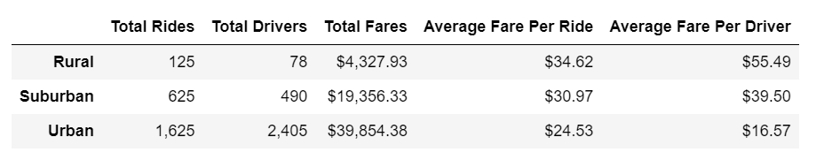

# PyBer Analysis

## Overview of the analysis
The purpose for analysing the Pyber data is to examine the relationship between city type and two other variables: the fares per ride and the fares per driver. The information from this analysis can influence business decisons made by the CEO.

## Resullts

### Summary Dataframe 

The summary dataframe in the image above shows that there are a lot more drivers in the urban areas compared to the rural and suburban areas. Although there are also a lot of rides in the urban areas, there seems to be a surplus of drivers as well. This makes the average fare per ride and per driver to be low. 
In the rural area, the demand for rides almost doubles the number of drivers. This causes the average fare per ride and per driver to be much higher than in the urban area. 
The suburban area seems to be in the middle, with the number of drivers not overpowering the number of rides. 

### Multiple-line Chart of Total Fares for Each City Type

The chart above shows the total fares per week over the period of January to April 2019 divided into the 3 city types. The Urban areas had the highest total fares, follwed by the suburban areas and then the rural areas. There is not a lot of variation in the fares over the 4 months, but there seems to me a peak in fares in all 3 areas in late February. 

## Summary
1. Having less drivers may allow the fare per ride to increase, as well as the fare per driver. 
2. Making your service available to more rural areas can bring some more income 
3. 
